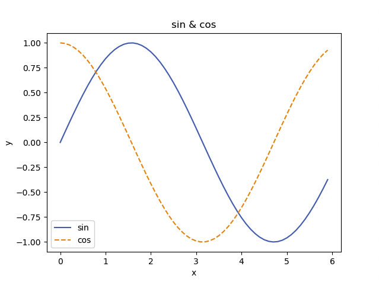

# Chapter 01. Hello, Python
## 1.5 라이브러리 numpy
딥러닝을 구현하다보면 배열이나 행렬에 관한 계산이 많이 등장하는데, 이때 `numpy`의 배열 클래스인 `numpy.array`는 이런 계산에 편리한 함수들을 제공한다.
### 1.5.5 브로드캐스트
`numpy`에서는 형상이 다른 배열끼리도 계산을 할 수 있다.
``` python
A = np.array([1,2],[3,4])
B = np.array([10,20])
```
이때 배열 B는 (1X2)는 자동으로 배열 A의 구조로 (2X2) **브로드캐스팅(broadcast)**하여 배열을 확장하여 계산한다.
```
arr A   +   arr B (broadcast) = arr A * arr B
1   2       10  20              10  40
3   4       10  20              30  80
```
## 1.6 라이브러리 Matplotlib
딥러닝 실험에서는 그래프 그리기와 데이터 시각화가 중요한데, 이때 그래프를 그려주는 라이브러리가 `Matplotlib`이다.
`Matplotlib`을 사용하면 데이터 시각화가 쉬워진다.
### 1.6.1 그래프 그리기
``` python
import numpy as np
import matplotlib.pyplot as plt

# 데이터 준비
x = np.arange(0,6,0.1) # 0에서 6까지 0.1 간격으로 생성
y1 = np.sin(x)
y2 = np.cos(x)

# 데이터 그리기
plt.plot(x,y1, label="sin")
plt.plot(x,y2, linestyle="--",label="cos") # cos 함수는 -- 점선으로 지정
plt.xlabel("x") # x축 이름
plt.ylabel("y") # y축 이름
plt.title("sin & cos") # 제목
plt.legend()
plt.show()
```


이 코드는 `numpy.arange` 메서드를 활용하여 `[0,0.1,0.2,...,5.8,5.9]` 라는 데이터를 생성하여 변수 x에 할당한 후 사인 그래프와 코사인 그래프를 그린 것이다.

### 1.6.3 이미지 표시하기
```python
import matplotlib.pyplot as plt
from matplotlib.image import imread

img = imread('../assets/test.png') # 이미지 읽어오기

plt.imshow(img)
plt.show()
```
* `imread`의 인자에는 상대경로, 절대경로 모두 가능하다.

### 1.7 정리
이번 장에서는 딥러닝 학습에 필요한 `Numpy`와 `Matplotlib`의 기본 활용방법에 대해 살펴보았습니다.
책의 초반부에서 기본적인 python 문법이 기술되어있었는데, 이부분은 스킵했습니다.
다음장부터는 퍼셉트론과 딥러닝, 신경망에 대해 공부하여 딥러닝에 대해 배워보도록 하겠습니다.