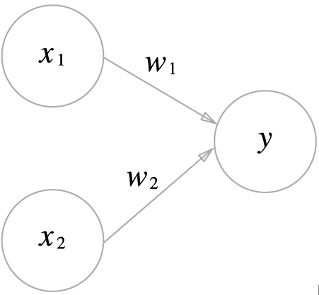

# Chapter 02. Perceptron 퍼셉트론
퍼셉트론은 다수의 신호를 입력으로 받아 하나의 신호를 출력합니다.



다음 그림은 입력으로 2개의 신호를 받은 퍼셉트론의 예입니다. 
x1,x2는 입력신호, y는 출력신호이며 w1,w2는 가중치를 의미합니다.
입력신호가 다음 노드로 보내질때 고유 가중치가 곱해져서 전달되며 뉴런에서 보내온 신호의 총합이 임곗값(theta)를 넘길때 1을 출력합니다.

$y = 
\left\{\begin{matrix} 0(w_1 x_1 + w_2 x_2 <= theta)
 \\ 1 (w_1 x_1 + w_2 x_2 > \theta)
\end{matrix}\right.$

퍼셉트론의 가중치는 각 신호가 결과에 주는 영향력을 조절하는 요소로 작용합니다. 즉, 가중치가 클수록 해당 신호가 그만큼 더 중요하다는 의미입니다.

## 2.3 퍼셉트론 구현하기
### 2.3.1 기본 GATE들 ( AND , NAND , OR )
``` python
import numpy as np

def AND(x1,x2) :
    x = np.array([x1,x2])
    w = np.array([0.5,0.5])
    b = -0.7
    tmp = np.sum(w*x) + b
    if tmp <= 0 :
        return 0
    else :
        return 1

def NAND(x1,x2) :
    x = np.array([x1,x2])
    w = np.array([-0.5,-0.5]) # AND와는 가중치와 편향이 다르다.
    b = 0.7
    tmp = np.sum(w*x) + b
    if tmp <= 0 :
        return 0
    else :
        return 1
NAND(0,0) # 1
NAND(1,0) # 1
NAND(0,1) # 1
NAND(1,1) # 0
    
def OR(x1,x2) :
    x = np.array([x1,x2])
    w = np.array([0.5,0.5]) # AND와는 가중치와 편향이 다르다.
    b = -0.2
    tmp = np.sum(w*x) + b
    if tmp <= 0 :
        return 0
    else :
        return 1
OR(0,0) # 0
OR(1,0) # 1
OR(0,1) # 1
OR(1,1) # 1
```

### 2.4.1 XOR GATE 구현하기
XOR 게이트는 베타적 논리합이라는 논리 회로로 x1과 x2중 한쪽이 1일 때만 1을 출력합니다. ( 베타적이란, 자기 외에는 거부한다는 의미)
XOR는 직접 구현이 불가능하여 다층 퍼셉트론(Multi-layer perceptron)을 만들어서 구현할 수 있습니다.

XOR 게이트는 AND, NAND, OR 게이트를 적절하게 쌓아서 표현할 수 있습니다.
``` python
def XOR(x1,x2) :
    s1 = NAND(x1,x2)
    s2 = OR(x1,x2)
    y = AND(s1,s2)
    return y

XOR(0,0) # 0
XOR(1,0) # 1
XOR(0,1) # 1
XOR(1,1) # 0
```

## 2.6 NAND에서 컴퓨터까지 마무리하며
다음과 같이 다층 퍼셉트론은 복잡한 회로를 만들수 있다. 
실제로 NAND게이트를 겹겹이 쌓음으로써 컴퓨터가 수행하는 복잡한 연산들을 하는 프로그램을 만들 수 있다.
**이론상, 2층퍼셉트론이면 컴퓨터를 만들 수 있다는 것이다.**

정확히는 비선형인 시그모이드 함수를 활성화 함수로 이용하면 임의의 함수를 표현할 수 있다는 사실이 증명되었다.(3장 참고)

퍼셉트론을 활용하여 처음에는 AND와 OR게이트를, 그다음에는 반가산기와 전가산기를 그다음에는 산술 논리 연산 장치를(ALU) 그 다음에는 CPU를 구현하는 듯이 점진적으로 개발해나가는건 정상적인 흐름이다.

우리는 퍼셉트론을 층층이 쌓아 신경망을 구성하고 이를 통해 딥러닝을 할 것이다.
퍼셉트론은 신경망의 기초가 되므로 중요함을 잊지말고 다음장으로 가보자!
