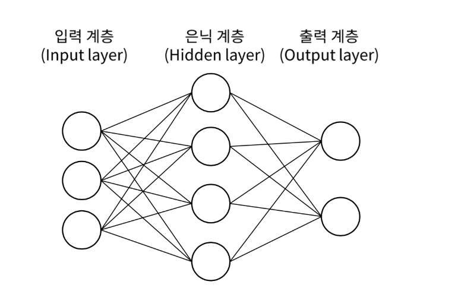
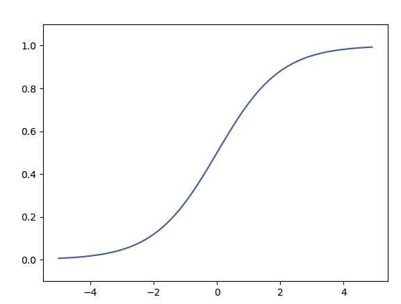
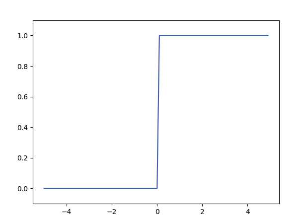
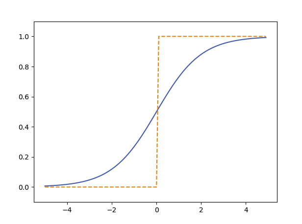
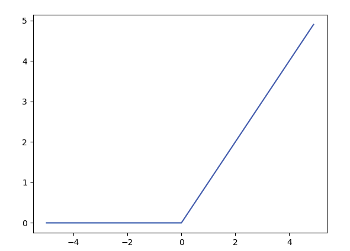
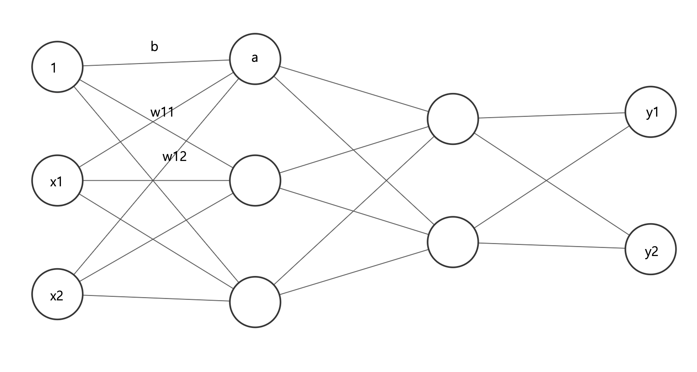

# Chapter 03. 신경망 
신경망은 가중치 매개변수의 적절한 값을 데이터로부터 자동으로 학습하는 능력을 갖추고있다는 것이 가장 중요한 점이다.

## 3.1 신경망의 구조


신경망은 여려층의 노드의 배열로 주로 **입력층, 은닉층, 출력층**으로 구분된다.

입력층은 아무 연산이 이루어지지 않으며 입력을 받아서 다음 계층으로 넘기는 역할을 한다. 신경망에 주어지는 초기 데이터(피쳐)의 개수에 따라 노드의 수가 결정된다.

은닉층은 복잡한 문제를 해결하여 학습하는 핵심계층이다. 입력된 데이터에서 패턴을 추출하고 비선형적인 관계를 학습하는 역할을 한다. 은닉층의 개수와 각 은닉층의 노드 수는 신경망의 성능에 큰 영향을 미치며 이를 **신경망의 깊이**라고한다.

출력층은 은닉층에서의 신호를 외부로 출력하는데 사용된다.

## 3.2 활성화 함수
활성화 함수는 입력 신호의 총합을 출력신호로 변환하는 함수를 의미한다.
이 함수의 결과에 따라 다음 퍼셉트론으로 신호를 보낼지에 대한 여부와 신호의 강도를 결정하게 하므로 활성화 함수는 신경망의 복잡도를 높이는 아주 중요한 요소이다. 활성화 함수는 신경망에 **비선형성**을 부여하며, 신경망이 비선형적인 복잡한 문제도 학습할 수 있도록 한다.

### 3.2.1 시그모이드 함수 Sigmoid function

$h(x) = \frac{1} {1 + exp(-x)}$

다음 함수는 과거 신경망에서 자주 활성화되는 함수이다.

```py
def sigmoid(x):
    return 1 / (1 + np.exp(-x))
```



시그모이드 함수의 치역은 (0,1)이며 연속적인 값을 가진다. 이는 출력을 확률처럼 해석할 수 있게 해주어 이진 분류 문제의 출력층에서 사용되기도 한다.

### 3.2.2 계단 함수
계단함수는 입력값이 0을 넘으면 1을 출력하고 그 이외에는 0을 출력하는 함수이다.
``` py
def step_funtion(x):
    y = x > 0 
    return y.astype(int)
```



이때, y는 `bool` 배열을 가지고있게 된다.
계단 함수는 0을 경계로 출력이 0에서 1로 바뀌는 형태를 가지고있다.

#### 활성화 함수의 역할과 비선형성
신경망에서 활성화 함수는 각 층의 출력을 비선형적으로 변환하는 핵심적인 역할을 한다.
만약 활성화 함수가 선형 함수라면, 여러 층을 쌀더라도 결국 하나의 선형 함수로 표현되어 신경망 학습의 한계가 생긴다. 비선형 활성화 함수를 사용하여야지만 신경망이 복잡한 비선형 패턴을 학습하고, XOR 문제와 같이 선형적으로 분리 불가능한 문제들을 해결할 수 있게 된다.

### 3.2.5 시그모이드 함수와 계단 함수의 비교



치역은 [0,1]로 동일하나 '매끄러움'의 차이를 가진다.
`sigmoid`함수는 부드로운 곡선으로 입력에 따라 출력이 연속적으로 변화하는 반면 `step`함수는 0을 경계로 출력이 급격하게 바뀌게 된다.
`sigmoid`함수의 이런 연속적인 매끈함은 신경망 학습에 매우 중요하다.

#### 기울기 소실 문제 (Vanishing Gradient Problem)
시그모이드 함수는 부드러운 곡선 형태를 가지지만, 입력값의 절댓값이 커질수록 기울기가 0개 가까워지는 **포화(Saturation)**영역이 존재한다. 이 영역에서는 기울기가 매우 작아지므로, 오차역전파 과정에서 여러 층을 거쳐 기울기가 전달될 때에 점차 작아져 결국 0으로 수렴하게 된다. 이를 **기울기 소실 문제**라고 하며, 이로 인해 특히 깊은 신경망에서 학습이 매우 느려지거나 멈추는 현상이 발생한다.

### 3.2.7 ReLU 함수
`ReLU(Rectified Linear Unit)` 함수는 0을 넘으면 그 입력을 그대로 출력하고 0 이하이면 0을 출력하는 함수이다.
``` py
def relu(x):
    return np.maximum(0,x)
```



$h(x) = 
\left\{\begin{matrix} x ( x >= 0 )
 \\ 0 ( x <= 0 )
\end{matrix}\right.$

ReLU함수는 양수 입력에 대해 항상 일정한 기울기를 가지므로 시그모이드 함수의 한계였던 기울기 소실 문제를 완화할 수 있다. 그러나 음수 입력에 대해서는 기울기가 0이므로, 한 번 비활성화된 뉴런은 학습중에 다시 활성화 되기 어렵다는 **죽은 ReLU 문제**가 발생할 수 있다.

## 3.4 3층 신경망 구현하기 
핵심은 신경망에서의 계산을 **행렬 계산**으로 처리할 수 있다는 것이다.

$$\begin{pmatrix}
1 & 2 \\
3 & 4 \\
\end{pmatrix} 
\begin{pmatrix}
5 & 6 \\
7 & 8 \\
\end{pmatrix} 
=
\begin{pmatrix}
19 & 22 \\
43 & 50 \\
\end{pmatrix}$$
``` python
A = np.array([[1,2],[3,4]])
B = np.array([[5,6],[7,8]])

np.dot(A,B) # 곱 출력
>>>
(
    [19,22],
    [43,50]
)
```
다음과 같이 행렬의 곱은 왼쪽 행렬의 행과 오른쪽 행렬의 열을 원소별로 곱하고 그 값을 더해서 계산한다.

$$1 \times 5 +2 \times7 = 19$$
$$ 3 \times 5 + 4 \times 7 = 43 $$

이때 코드에서 `np.dot`은 행렬의 곱을 연산하는데 입력이 1차원 배열이면 벡터를, 2차원 배열이면 행렬 곱을 출력한다.

주의할 점은 행렬의 형상이다.
왼쪽행렬의 1번째 차원의 원소 수(열 수)와 오른쪽 행렬의 0번째 차원의 원소수(행 수)가 같아야한다.

즉, $A = m \times n$ 행렬이고 $B = n \times p$ 이여야지만 $A \times B$ 연산이 가능하며 결과 행렬은 $m \times p$가 된다.

### 3.4.1 신경망의 가중치와 편향 표기법
이때 이 그림은 뉴런 $x_2$에서 다음층의 뉴런인 ${a_1}^{(1)}$로 향하며 가중치는 $w_{12}^{(1)}$을 가지고 있다. 이 표기법에 대해 알아보자.

가중치의 지수부의 $(1)$은 1층의 가충치임을 명시하고있다. 또 아래의 숫자 $1$과 $2$는 앞층의 2번째 뉴런에서 다음 층의 1번째 뉴런으로 향함을 의미한다. 가중치 오른쪽 아래의 인덱스 번호는 '다음 층 번호, 앞 층 번호'순으로 적는다.

- **가중치($W$)**
  - 지수부의 $(1)$은 **1층의 가중치**임을 명시한다.
  - 아래첨자 $ij$는 $i$는 **다음 층의 뉴런 번호**, $j$는 **앞 층의 뉴런 번호**를 의미한다.
  - 입력층의 노두 수(열) X 다음층(1층)의 노드 수(행)이다.
- **편향($B$)**
  - 편향은 다음 층의 각 뉴런에 독립적으로 더해지는 값이다.
  - $b_{1}^{1}$는 1층의 1번째 뉴런에 더해지는 값이다.
  - 뉴런이 얼마나 쉽게 활성화 되는지 조절할 수 있다. 이는 선형 회귀에서 절편과 유사한 역할을 하여, 데이터가 원점을 지나지 않아도 모델이 유연하게 학습할 수 있도록 돕는다.
  


### 3.4.2 활성화 전 신호의 계산
그렇다면 ${a_1}^{(1)}$를 계산해보도록 하겠다.
$$a_{1}^{(1)} = w_{11}^{1} x_1 + w_{12}^{1}x_2 + b_{1}^{1}$$
여기서 행렬 곱을 이용해보자.
$$A^{(1)} = XW^{(1)}+B^{(1)}$$
로 간소화할 수 있다.
이때, 가중치부분은 다음과 같다.
$$
A^{(1)} = (a_{(1)}^{(1)} , a_{(2)}^{(1)}, a_{(3)}^{(1)}) (1층활성화 전 신호 벡터)
$$
$$
X = (x_1 , x_2) (입력 벡터)
$$
$$
B^{(1)} = (b_{1}^{(1)} , b_{2}^{(1)} , b_{2}^{(1)}) (1층 편향 벡터)
$$
$$
W^{(1)} = 
\begin{pmatrix}
w_{11}^{(1)} &w_{21}^{(1)}  &w_{31}^{(1)}  \\
w_{12}^{(1)} &w_{22}^{(1)}  &w_{32}^{(1)}  \\
\end{pmatrix} (1층 가중치 행렬)
$$

```python
X = np.array([1.0,0.5])
W1 = np.array([[0.1,0.3,0.5],[0.2,0.4,0.6]])
B1 = np.array([0.1,0.2,0.3])

print(W1.shape) #   (2,3)
print(X.shape)  #   (2,)
print(B1.shape) #   (3,)

A1 = np.dot(X,W1) + B1
```
### 3.4.3 활성화 함수의 적용
이어서 1층의 활성화 함수의 처리를 살펴보자면 위와 같이 은닉층에서의 가중치 합을 $a$라고 표기하고 활성화 함수 $h()$의 처리결과를 $z$로 표기한다.
``` python
A1 = np.dot(X,W1) + B1
Z1 = sigmoid(A1)

print(A1)   #   [0.3 0.7 1.1]
print(Z1)   #   [0.57444252 0.66818777 0.75026011]
```
### 3.4.4 다음 층으로의 전달 (1층 -> 2층)
이어서 1층에서 2층으로 가는 과정을 구현해본다.
```python
W2 = np.array[[0.1, 0.4],[0.2, 0.5],[0.3, 0.6]]
B2 = np.array([0.1, 0.2])

print(Z1.shape) #   (3,)
print(W2.shape) #   (3,2)
print(B2.shape) #   (2,)

A2 = np.dot(Z1,W2) + B2 # 이전층의 출력은 다시 다음층의 입력이 된다.
Z2 = sigmoid(A2)
```
### 3.4.5 출력층으로의 전달
마지막으로, 은닉층에서 출력층으로의 전달을 구현해보자.
이전과의 차이점은 **활성화 함수가 다르다**.
``` python
W3 = np.array([0.1, 0.3],[0.2, 0.4])
B3 = np.array([0.1, 0.2])

A3 = np.dot(Z2,W3) + B3
Y = identity_function(A3) # Y = A3 와 같다.
```
출력층의 활성화 함수는 풀고자 하는 문제의 성질에 맞게 정한다.
예를 들어 회귀에는 항등함수를, 2클래스 분류에는 시그모이드 함수를, 다중 클래스 분류에는 소프트 맥스를 사용하는 것이 일반적이다.
- **회귀(Regression)문제** -> 주택 가격 예측
- **2클래스 분류** -> 합격/불합격
- **다중 클래스 분류** -> 손글씨 숫자 인식 등

### 최종 구현 (전체 신경망 순전파)
```python

def init_network() :
    network = {}
    network['W1'] = np.array([[0.1, 0.3, 0.5],[0.2, 0.4, 0.6]])
    network['b1'] = np.array([0.1,0.2,0.3])
    network['W2'] = np.array([[0.1,0.4],[0.2,0.5],[0.3,0.6]])
    network['b2'] = np.array([0.1,0.2])
    network['W3'] = np.array([[0.1,0.3],[0.2,0.4]])
    network['b3'] = np.array([0.1,0.2])

    return network

def forward(network, x):
    W1,W2,W3 = network['W1'],network['W2'],network['W3']
    b1,b2,b3 = network['b1'],network['b2'],network['b3']

    a1 = np.dot(x,W1) + b1
    z1 = sigmoid(a1)
    a2 = np.dot(z1,W2) + b2
    z2 = sigmoid(a2)
    a3 = np.dot(z2,W3) + b3
    y = a3
    return y

network = init_network()
x = np.array([1.0,0.5])
y = forward(network, x) #   [0.31682708 0.69627909]
print(y)
```
위 코드는 입력층에서 출력층 까지 신호가 한 방향으로 전달되는 순전파(Forward Propagation)과정을 구현하였다. 이 코드의 출력이 실제 정답과 얼마나 차이나는지 오차를 계산하여 역전파(Backpropagation)를 통해 가중치와 편향을 업데이트하며 학습을 진행한다.